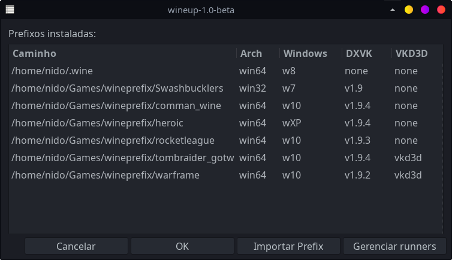

# wineup
Gerencia os prefixos do wine e baixa/atualiza versões do WINE e PROTON, com interface em Zenity

* Compativel com:
  * WINE-GE
  * WINE-Lutris
  * WINE-TKG
  * Proton-GE
  * Proton-TKG
  * Luxtorpeda-DEV
  * DXVK
 
## Dependencias:
 * lynx
 * zenity
 * aria2

## Modo de Uso:
$ wineup

